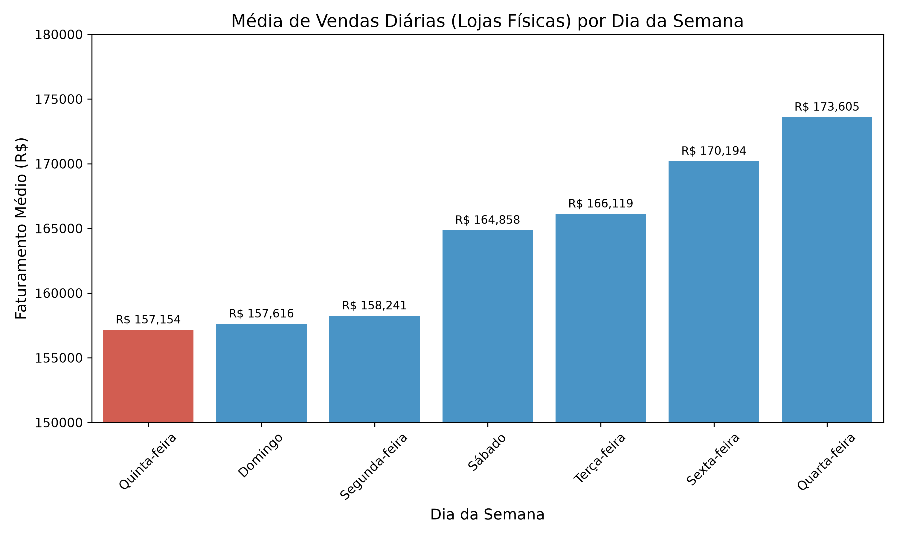
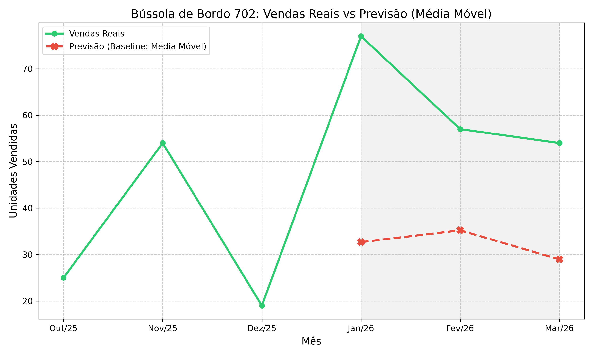

# Relatório Executivo - LH Nautical
**Autor:** Especialista de Dados
**Data:** Agosto de 2026
**Público-Alvo:** Sr. Almir (Fundador), Marina Costa (Gerente de Negócios) e Gabriel Santos (Tech Lead)

---

## 1. O Pior Dia da Semana e o Perigo das Médias "Mascaradas"
A análise sobre o faturamento diário das lojas físicas (para definir a viabilidade de fechamento) trouxe à tona uma discrepância importante.

**O Fato:**
O estagiário havia apontado o *Domingo* como o melhor dia para a empresa, utilizando cálculos diretamente sobre a tabela de vendas. No entanto, sua metodologia ignorou completamente os dias em que a loja abriu, operou, mas não vendeu nada (faturamento zero).
Ao preencher esses dias vazios utilizando um Calendário Dimensional (garantindo que os dias sem venda puxassem a média para baixo), o verdadeiro ranking veio à tona:
**A Quinta-feira é efetivamente o pior dia de vendas da empresa.**

**Recomendação (Sr. Almir / Marina):**
Apesar de ser o pior dia, a diferença da Quinta-feira para o dia mediano é de apenas ~10% (cerca de R$ 16 mil/dia). **Não há base de dados para sustentar o fechamento das lojas físicas.** Em vez de fechar as portas, a recomendação estratégica é transformar a fraqueza da quinta-feira em uma "Quinta Náutica", focando em esforços promocionais específicos para alavancar o movimento nesse dia de vale.

---

## 2. Previsão de Demanda e o Custo de Confiar em Modelos Inadequados
O Sr. Almir reportou perdas financeiras no verão passado devido a rupturas no estoque de "Coletes Salva-Vidas", e o Tech Lead solicitou que substituíssemos o "feeling" por uma previsão estatística de **Média Móvel de 3 meses**.

Para testar a acurácia, aplicamos esse baseline no produto "Bússola de Bordo 702" para prever o Verão de 2026.

**O Fato:**
O baseline da Média Móvel resultou num **Erro Médio Absoluto (MAE) inaceitável de ~30 unidades/mês**, superando os 50% de erro em Janeiro. 

**Por que a Média Móvel falha?**
Modelos de Média Móvel sofrem de inércia e são **incapazes de prever sazonalidade**. Ao prevermos a demanda do Verão (Q1), o modelo engessou as projeções baseando-se estritamente na Primavera (Q4). Se adotássemos esse modelo estatístico, a empresa enfrentaria rupturas severas de Bússolas logo em Janeiro (previsto: 32, realizado: 77).

**Recomendação:**
O modelo de Média Móvel deve ser descartado para itens sazonais náuticos. Para prever estoques para o Sr. Almir sem falhas, modelos que compreendam a anualidade (como ARIMA, Prophet ou regressões multivariadas que incluam o fator "mês do ano") devem ser a fundação do pipeline.

---

## 3. A Vitrine de Cross-Selling: "Quem comprou isso, também levou..."
A Gerente de Negócios (Marina) notou que clientes frequentemente compravam itens primários, mas esqueciam de levar acessórios cruciais (como defensas). Para resolver o problema e aumentar o ticket médio da LH Nautical, construímos um Motor de Recomendação sem a necessidade de ferramentas de Big Data caras.

**A Metodologia Aplicada:**
Utilizamos a técnica de **Similaridade de Cosseno** (Cosine Similarity) cruzando matrizes de usuários. Se os mesmos clientes compram frequentemente dois produtos diferentes ao longo de sua jornada, o motor traça uma similaridade matemática.

**Ranking para "Motor de Popa 1949":**
1. Vela Mestra 1913
2. Cabo Náutico 2105
3. Sonar Transducer 7193
4. Motor de Popa 5331

> **Nota Crítica de Dados (Para o Tech Lead):** Em terceiro lugar no ranking original o sistema apontou a venda cruzada com um produto chamado **"asdf"**. Isso indica que há sujeira na tabela de produtos da produção, e que itens de testes utilizados por desenvolvedores foram comprados junto de produtos reais. A higienização urgente desse cadastro é recomendada para que nomes falsos não vazem para os clientes finais.
