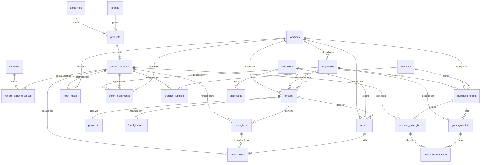

# Diagrama de Entidade-Relacionamento (LH Nautical)

Abaixo apresento a modelagem dos 24 arquivos CSV, organizados logicamente pelos seus domínios de negócio para facilitar nosso entendimento.

```mermaid
erDiagram
    %% Domínio: Catálogo e Produtos
    brands ||--|{ products : "possui"
    categories ||--|{ products : "contém"
    products ||--|{ product_variants : "tem"
    product_variants ||--|{ variant_attribute_values : "possui valor de"
    attributes ||--|{ variant_attribute_values : "define"

    %% Domínio: Vendas
    customers ||--|{ orders : "faz"
    employees ||--o{ orders : "vende (salesperson)"
    locations ||--|{ orders : "ocorre em"
    orders ||--|{ order_items : "contém"
    product_variants ||--|{ order_items : "vendido como"
    orders ||--|{ payments : "pago via"
    orders ||--o{ fiscal_invoices : "faturado em"

    %% Domínio: Devoluções (Returns)
    orders ||--o{ returns : "pode ter"
    customers ||--|{ returns : "solicita"
    locations ||--|{ returns : "recebido em"
    returns ||--|{ return_items : "contém"
    order_items ||--o{ return_items : "item devolvido"
    product_variants ||--o{ return_items : "trocado por"

    %% Domínio: Estoque e Logística
    locations ||--|{ stock_levels : "armazena"
    product_variants ||--|{ stock_levels : "rastreado em"
    locations ||--|{ stock_movements : "ocorre em"
    product_variants ||--|{ stock_movements : "movimentado"
    employees ||--o{ stock_movements : "registrado por"

    %% Domínio: Compras e Fornecedores
    suppliers ||--|{ product_suppliers : "fornece"
    product_variants ||--|{ product_suppliers : "fornecido por"
    suppliers ||--|{ purchase_orders : "atende"
    locations ||--|{ purchase_orders : "entregue em"
    employees ||--o{ purchase_orders : "comprador"
    purchase_orders ||--|{ purchase_order_items : "contém"
    product_variants ||--|{ purchase_order_items : "item pedido"
    
    %% Recebimento de Mercadorias (Goods Receipt)
    purchase_orders ||--o{ goods_receipts : "gera"
    employees ||--o{ goods_receipts : "recebido por"
    goods_receipts ||--|{ goods_receipt_items : "contém"
    purchase_order_items ||--|{ goods_receipt_items : "referente a"

    %% Entidades Base
    customers ||--|{ addresses : "possui"
    locations ||--o{ employees : "alocado em"
```
